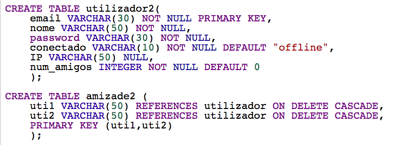

# LPOO_FinalProject

Carolina da Ponte Rocha 201304026 up201304026@fe.up.pt

Manuel Fernando Sequeira Pereira 201205052 ee12314@fe.up.pt

## Setup/Installation procedure

Colocar o ficheiro Chat.jar e o chromedriver.exe (windows) ou chromedriver (mac) na mesma pasta e correr o ficheiro Chat.jar

## Development documentation
### UML

### SQL

A nossa maior dificuldade no desenvolvimento da aplicação consistiu no design da mesma na fase inicial, mais concretamente nas classes que deveriam ser criadas e como estas deveriam interagir.

Overall time spent developing: cerca de 65 horas
Work distribution amongst team members: 50% Carolina; 50% Manuel

## User Manual

A janela inicial é usada para o utilizador fazer log in no chat ou sign in caso não se encontre registado.

Esta janela é a que resulta da escolha do botão Sign In, na janela inicial. Aqui, o utilizador poderá escolher um username, email e password com que deseja ser identificado.

Esta janela é a janela principal do chat. É possivel fazer pesquisa de amigos, visualizar a lista de amigos online, selecionar o amigo e enviar-lhe mensagens, assim como ver o histórico de mensagens à medida que estas são enviadas. Também é possível fazer log out ou alterar informações da conta (settings). 

Ao pesquisar por amigos, abre esta janela com uma lista de possiveis amigos. Será possível selecionar o nome desejado e adicionar à lista de amigos.

Ao selecionar Settings será possível editar qualquer informação relacionada com o utilizador.

No pdf ChatPrototype encontra-se o protótipo com os links entre as páginas.
