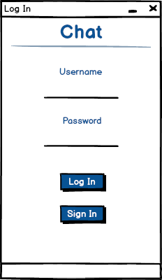
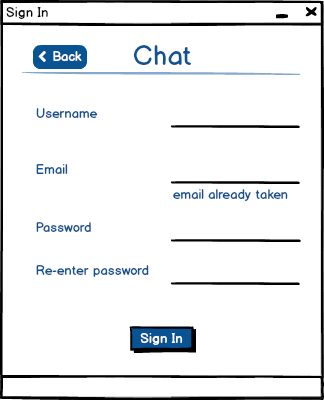
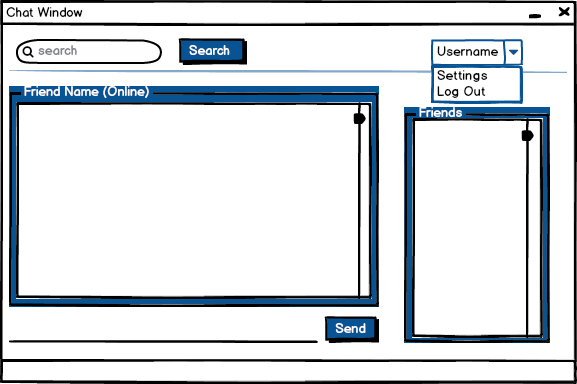
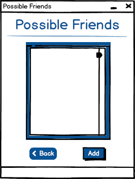
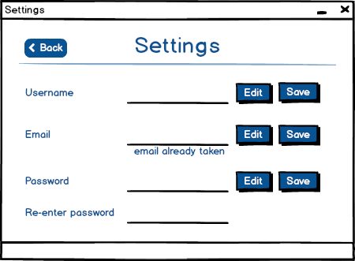

# LPOO_FinalProject

Carolina da Ponte Rocha 201304026 up201304026@fe.up.pt

Manuel Fernando Sequeira Pereira 201205052 ee12314@fe.up.pt

## Architecture Design
### Design Patterns
#### Singleton Pattern
É usada na package "mySQLConnection" para as classes da package server não criarem várias instâncias de modo a fazerem vários logIns no MySQL e evitar colisões de acesso à  base de dados.

## GUI Design

## Test Design
#### Registo de cliente 
Fazer um registo e ir procurar à base de dados se foi registado com sucesso;

#### LogIn 
Fazer logIn e verificar se na base de dados ficou online;

#### Registo de cliente com mesmo email 
Deve dar um erro de que já existe um cliente com o mesmo email;

#### LogOut 
Fazer log out e ver se na base de dados o user ficou a offline;

#### Enviar e receber mensagens 
Enviar mensagem para si próprio e verificar que recebe;

#### Procura de amigos com mesmo nome 
Verificar que user não pode ser amigo de si mesmo;
